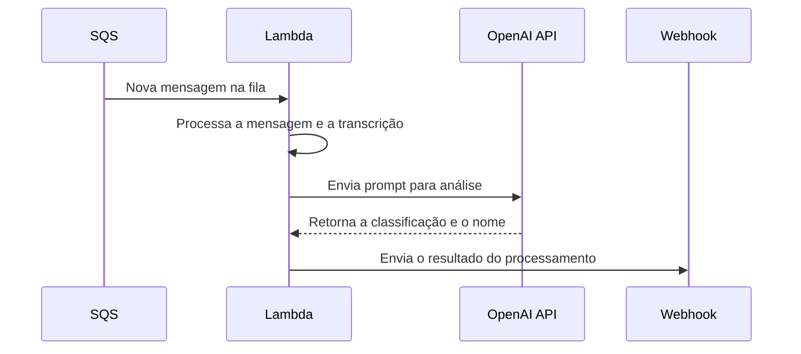

# Lambda de Processamento de Transcrição

Esta função Lambda é projetada para processar transcrições de áudio de forma assíncrona. Ela consome mensagens de uma fila Amazon SQS, utiliza um modelo de linguagem grande (LLM) da OpenAI para análise e, em seguida, envia o resultado para um webhook.

## Funcionalidade Principal

O fluxo de trabalho da Lambda pode ser dividido nas seguintes etapas:

1.  **Consumo de Mensagens SQS**: A Lambda é acionada por novas mensagens em uma fila SQS. Cada mensagem contém a transcrição de um áudio, juntamente com metadados como `userId`, `squadId`, `transcriptionId`, e as `categorias` para classificação.

2.  **Análise com LLM**: A transcrição é enviada para um modelo de linguagem da OpenAI. A Lambda constrói um prompt detalhado para o modelo, instruindo-o a:
    *   Classificar a transcrição em uma das categorias fornecidas.
    *   Gerar um nome curto e neutro que descreva o contexto principal da transcrição.

3.  **Envio para Webhook**: Após receber a resposta do LLM, a Lambda formata os dados e os envia para um webhook pré-configurado. A requisição para o webhook inclui um cabeçalho `x-webhook-secret` para autenticação.

## Diagrama do Fluxo

O diagrama abaixo ilustra o fluxo de trabalho da Lambda:



## Variáveis de Ambiente

A Lambda utiliza as seguintes variáveis de ambiente para sua configuração:

*   `BASE_URL`: A URL base da API da OpenAI.
*   `OPENAI_API_KEY`: A chave de API para autenticação com a OpenAI.
*   `MODEL_OPENAI`: O nome do modelo da OpenAI a ser utilizado.
*   `WEBHOOK_URL`: A URL do webhook para onde os resultados serão enviados.
*   `WEBHOOK_SECRET`: O segredo para autenticação com o webhook.

## Como Executar

1.  Instale as dependências:
    ```bash
    npm install
    ```

2.  Compile o código TypeScript:
    ```bash
    npm run build
    ```

3.  Configure as variáveis de ambiente em um arquivo `.env`.

4.  Faça o deploy da função no AWS Lambda e configure o gatilho do SQS.
